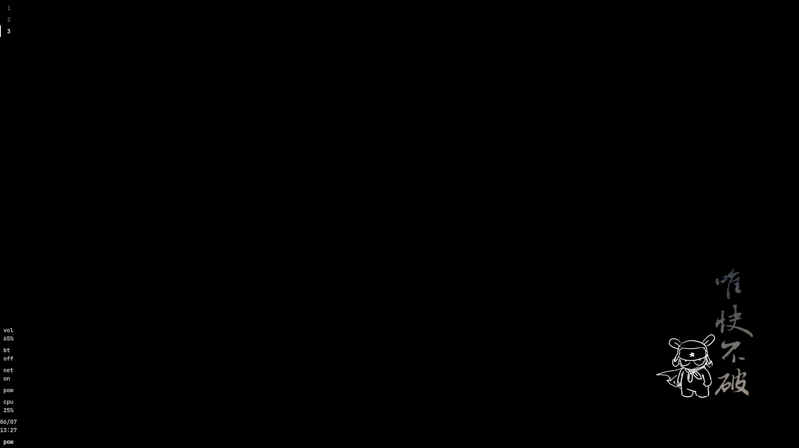
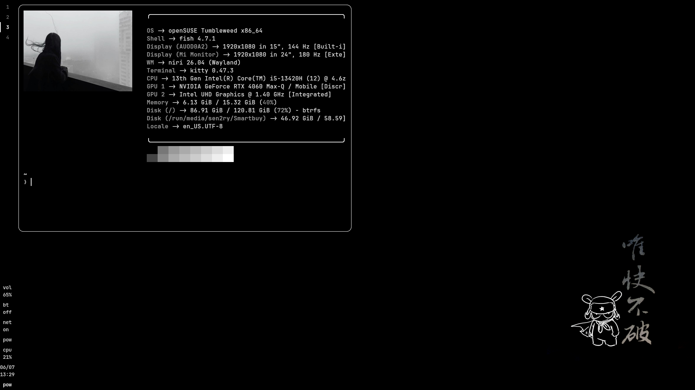

# Custom rice

Monochrome rice based on openSUSE Tumbleweed & the niri compositor

## SysInfo

- Distro: OpenSUSE Tumbleweed x86_64
- WM: niri
- shell: fish
- terminal: kitty
- bar: waybar
- launch: fuzzel
- notification: mako

## Structure

```text
.
├── desktop
│   ├── image.png
│   └── wtl0g.png
├── fastfetch
│   └── config.jsonc
├── fish
│   ├── completions
│   ├── conf.d
│   │   └── fish_frozen_key_bindings.fish
│   ├── config.fish
│   ├── fish_variables
│   └── functions
├── fuzzel
│   └── fuzzel.ini
├── kitty
│   └── kitty.conf
├── logo
│   └── ssd.jpeg
├── mako
│   └── config
├── niri
│   └── config.kdl
├── README.md
├── wallpaper
│   └── saasa.png
└── waybar
    ├── config
    └── style.css

14 directories, 15 files
```

## Screenshot

### Desktop 


### Terminal



